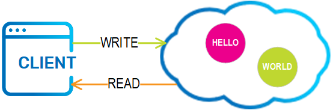
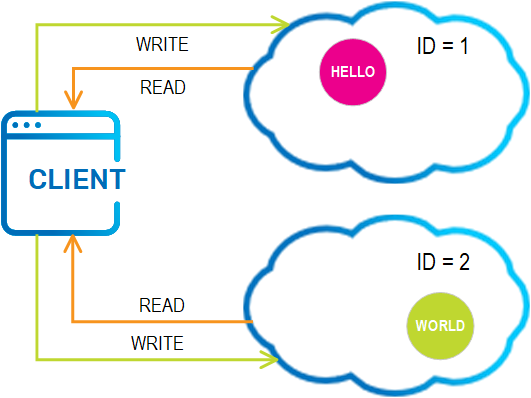
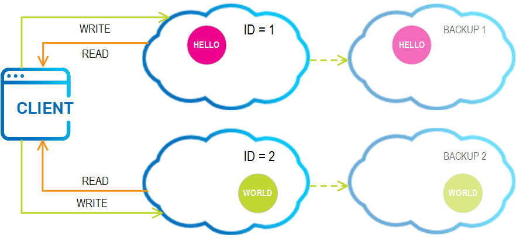

# Hello World Example

This example demonstrates the basic concepts behind GigaSpaces data grid.

# Overview

There are two counter parts: a client and a server. The client, "HelloWorld.java" updates a 
data-grid with "Hello" and "World!" data entities and then reads them back.

## Message.java

A Plain Old Java Object (POJO) is the entity behind the updates to the data-grid. 
It consists of getters and setters for the 'msg' field, and a `@SpaceId` for uniqueness (similar to a Map key).

### Annotations

Additional annotations can be applied - here are a couple:

- A `@SpaceRouting` annotation can be applied to any field to allow routing to partition instances. If not specified, 
`@SpaceId` will act as the routing field.
- A `@SpaceIndex` annotation can be applied to any field to allow indexing. `@SpaceId` is by default indexed.

## HelloWorld.java

This main class can either start a single data-grid instance (embedded) in it's JVM for easy development, or connect
to an existing (remote) data-grid (by specifying its name).

# Running The Example

This example is a standard maven project - Use maven to execute the main class:

`mvn compile && mvn exec:java -Dexec.mainClass=HelloWorld -Dexec.args="-name myDataGrid -mode embedded"`

Alternatively, if you have an IDE available, import the sources as a maven project using the POM: 

`examples/hello-world/pom.xml`

The `HelloWorld` main class accepts the following arguments: `-name` {data-grid name} `-mode` {embedded | remote}

## Running in Embedded Mode

Launch the `HelloWorld` main (arguments: `-name` myDataGrid `-mode` embedded)

This will start an embedded data-grid followed by write and read of Message entities.

### output
```

Created embedded data-grid: myDataGrid

write - 'Hello'

write - 'World!'

read - ['Hello', 'World!']

```


## Running in Remote Mode

To connect to a *remote* data-grid, you need a cluster manager to host the data grid. 

### Overview - Cluster Managers

A data grid requires a cluster manager. The following cluster managers are available:

* Standalone
* Service Grid
* Kubernetes
* ElasticGrid

The "Service Grid" is recommended for beginners, which is what we'll show here. 
If you're using the open source package, you'll need to use the "Standalone" cluster manager, 
which is discussed later in this page.  

*Tip*: The cluster manager includes a web-based UI which is started at http://localhost:8090

### Deploying a data grid

To start the service grid locally with a single container, run the `bin/gs.(sh|bat)` as follows:

- gs.(sh|bat) host run-agent --auto --containers=1

To deploy a data grid called `myDataGrid`, run:

- gs.(sh|bat) space deploy myDataGrid



Now that we have a remote data-grid, we can connect to it.

Using maven: 

`mvn compile && mvn exec:java -Dexec.mainClass=HelloWorld -Dexec.args="-name myDataGrid -mode remote"`

Using IDE:

Launch the `HelloWorld` main (arguments: `-name` myDataGrid `-mode` remote)

This will connect your  client to your remote data-grid followed by write and read of Message entities.

### output
```

Connected to remote data-grid: myDataGrid

write - 'Hello'

write - 'World!'

read - ['Hello', 'World!']

```

### Stopping the data grid

To terminate the local service grid agent, run:

- gs.(sh|bat) host kill-agent

### Deploying a data-grid with 2 partitions (optional)

Use the same commands, but specify 2 containers (1 per instance), and add the `--partitions` parameter:

- gs.(sh|bat) host run-agent --auto --containers=2
- gs.(sh|bat) space deploy myDataGrid --partitions=2



### Deploying a data-grid with 2 highly-available partitions (optional)

Use the same commands, but specify 4 containers (1 per instance), and add the `--ha` parameter:

- gs.(sh|bat) host run-agent --auto --containers=4
- gs.(sh|bat) space deploy myDataGrid --partitions=2 --ha




## Starting standalone data grid instance/s (without Service Grid)

Without the Service Grid, you will need to run the following commands using `bin/gs.(sh|bat)`

### Single data grid instance

-  gs.(sh|bat) space run --lus myDataGrid

### Data grid with 2 partitions

-  gs.(sh|bat) space run --lus --partitions=2 myDataGrid

#### Manually load each instance separately

Each partition instance loads separately, as follows:

1. Specify `--partitions=2` for two partitions
2. Specify `--instances=1_1` or `--instances=2_1` for each partition instance

From the ${GS_HOME}/bin directory, run (in 2 separate terminals):

-  gs.(sh|bat) space run --lus --partitions=2 **--instances=1_1** myDataGrid
-  gs.(sh|bat) space run --lus --partitions=2 **--instances=2_1** myDataGrid

This will simulate a data-grid of 2 partitioned instances (without backups).

### Data grid with 2 highly available partitions (with backups for each partition)

-  gs.(sh|bat) space run --lus --partitions=2 --ha myDataGrid

#### Manually load each instance separately

Each partition instance can be assigned a backup, as follows:

1. Specify `--partitions=2` for two partitions, `--ha` for high availability meaning a single backup for each partition.
2. Specify `--instances=1_1` to load primary of partition id=1, `--instances=1_2` to load the backup instance of partition id=1

**First partition:**

- gs.(sh|bat) space run --lus --partitions=2 --ha **--instances=1_1** myDataGrid
- gs.(sh|bat) space run --lus --partitions=2 --ha **--instances=1_2** myDataGrid

**Second partition:**

-  gs.(sh|bat) space run --lus --partitions=2 --ha **--instances=2_1** myDataGrid
-  gs.(sh|bat) space run --lus --partitions=2 --ha **--instances=2_2** myDataGrid
